English | [العربية](README.ar.md)

---

# 🍕 Pizza Sales Performance & Operations Analytics (2015)

---

## 📑 Table of Contents

- [Project Overview](#-project-overview)
- [Business Problem & Objectives](#-business-problem--objectives)
- [Tech Stack & Data Pipeline](#-tech-stack--data-pipeline)
  - [Tools & Technologies](#1-tools--technologies)
  - [End-to-End Data Pipeline](#2-end-to-end-data-pipeline)
  - [SQL Implementation & Analysis](#-sql-implementation--analysis)
  - [Excel Data Processing & Dashboard](#-excel-data-processing--dashboard)
  - [Power BI Interactive Dashboard](#-power-bi-interactive-dashboard)
- [Executive Insights & Key Findings](#-executive-insights--key-findings)
- [Repository Structure](#-repository-structure)
- [How to Run & Replicate](#-how-to-run--replicate)
- [Connect with Me](#-connect-with-me)

---

## 📌 Project Overview

This project delivers a comprehensive end-to-end data analysis solution for a retail pizza outlet throughout the year 2015. By evaluating overall sales metrics, peak demand periods (hourly, daily, and monthly), product category performance, and pizza size preferences, this project transforms raw transactional data into actionable operational insights.

The primary goal is to help store management optimize inventory, streamline staffing schedules during peak hours, and tailor promotional strategies toward high-performing products.

---

## 🎯 Business Problem & Objectives

### 1. Business Context

The store management currently lacks centralized visibility into historical sales performance and operational patterns. Without data-driven insights, it is challenging to optimize staffing schedules, manage inventory efficiently, or make informed marketing decisions to push underperforming items.

### 2. Project Objectives

This analysis aims to address these challenges by answering key business questions across four main pillars:

- **Key Performance Indicators (KPIs):**
  - Measure total financial performance (**Total Revenue**).
  - Evaluate transaction size and spending habits (**Average Order Value - AOV**).
  - Track total unit volume (**Total Pizzas Sold** & **Total Orders**).
  - Calculate order density (**Average Pizzas Per Order**).

- **Trends & Seasonality:**
  - **Daily Trend:** Identify peak sales days throughout the week.
  - **Monthly Trend:** Analyze order volume fluctuations across different months/seasons.
  - **Hourly Trend:** Determine peak operational hours during the day to optimize staffing and kitchen workflows.

- **Category & Product Breakdown:**
  - **Sales by Category:** Calculate revenue contribution across categories (Classic, Supreme, Chicken, Veggie).
  - **Sales by Size:** Evaluate customer preference distribution across sizes (S, M, L, XL, XXL).

- **Product Performance (Top & Bottom Performers):**
  - Identify **Top 5** and **Bottom 5** pizzas based on **Revenue** generated.
  - Identify **Top 5** and **Bottom 5** pizzas based on **Quantity** sold.

---

## 🛠️ Tech Stack & Data Pipeline

### 1. Tools & Technologies

- **Data Source:** [Kaggle](https://www.kaggle.com) (Pizza Sales Dataset 2015 - CSV format)
- **Data Exploration & Cleaning:** Microsoft Excel & Power Query
- **Database Management & Querying:** PostgreSQL / SQL Server (SQL Queries)
- **Data Visualization & Analytics:** Power BI (DAX, Interactive Dashboards)
- **Version Control:** Git & GitHub

---

### 2. End-to-End Data Pipeline

`[Raw CSV (Kaggle)]` ➡️ `[Excel / Power Query (EDA & Cleaning)]` ➡️ `[SQL Database (Schema Setup & Queries)]` ➡️ `[Power BI (Modeling, DAX & Visualization)]`

- **Step 1: Data Exploration & Cleaning (Excel & Power Query)**
  - Performed initial Exploratory Data Analysis (EDA) to understand the dataset structure and column distributions.
  - Used Power Query for initial cleaning, data type validation, missing value checks, and date/time formatting.

- **Step 2: Database Setup & Query Execution (SQL)**
  - Created a dedicated database schema matching the cleaned dataset structure.
  - Imported the processed CSV data into SQL tables.
  - Wrote complex SQL queries to extract key operational insights, test KPI calculations, and answer core business questions.

- **Step 3: Modeling & Dashboard Creation (Power BI & Excel)**
  - Imported data into Power BI and established relationships.
  - Created custom DAX Measures for dynamic key performance indicators (Total Revenue, AOV, Total Pizzas Sold, etc.).
  - Designed an interactive, modern user interface adhering to the 60-30-10 layout design principles for executive reporting.

- **Step 1: Data Exploration & Cleaning (Excel & Power Query)**
  - Performed initial Exploratory Data Analysis (EDA) to understand the dataset structure and column distributions.
  - Used Power Query for initial cleaning, data type validation, missing value checks, and date/time formatting.

- **Step 2: Database Setup & Query Execution (SQL)**
  - Created a dedicated database schema matching the cleaned dataset structure.
  - Imported the processed CSV data into SQL tables.
  - Wrote complex SQL queries to extract key operational insights, test KPI calculations, and answer core business questions.

- **Step 3: Modeling & Dashboard Creation (Power BI & Excel)**
  - Imported data into Power BI and established relationships.
  - Created custom DAX Measures for dynamic key performance indicators (Total Revenue, AOV, Total Pizzas Sold, etc.).
  - Designed an interactive, modern user interface adhering to the 60-30-10 layout design principles for executive reporting.

---

### 🗄️ SQL Implementation & Analysis

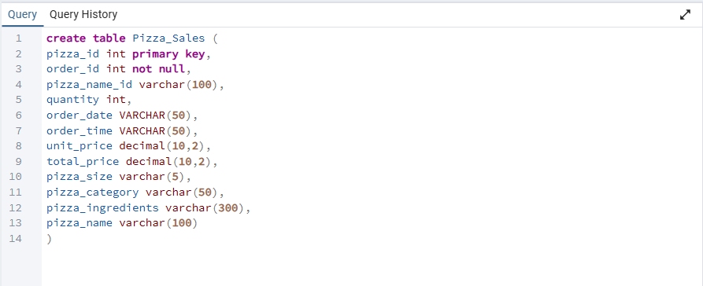
*Designed and executed the relational table schema in SQL, matching the structured CSV attributes to prepare the database for data ingestion.*

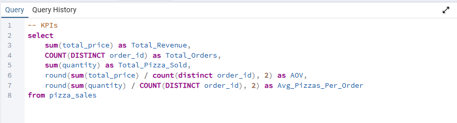
*Wrote optimized SQL queries to calculate core business KPIs, including Total Revenue, Average Order Value (AOV), Total Pizza Sold, and Total Orders.*

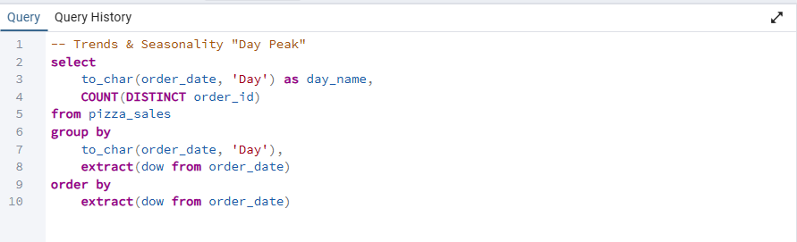
*Analyzed order distribution across days of the week to identify peak operational periods and high-demand days.*

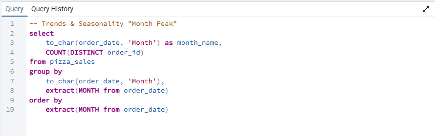
*Tracked monthly sales trends to uncover seasonality patterns and revenue fluctuations throughout the year.*

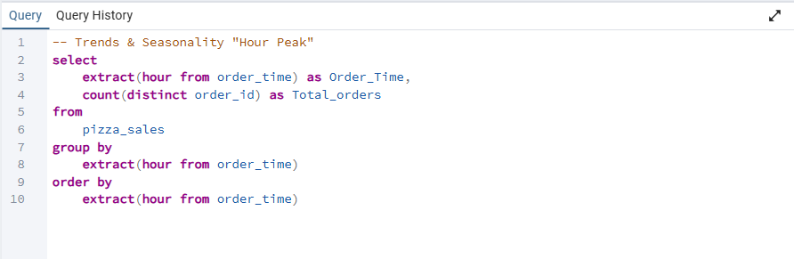
*Evaluated hourly order trends to map out rush hours and optimize kitchen staffing and delivery efficiency.*

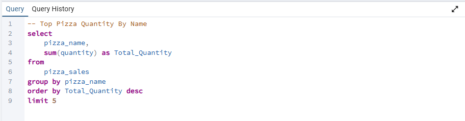
*Identified the top 5 best-selling pizzas based on total volume sold to highlight customer favorites.*

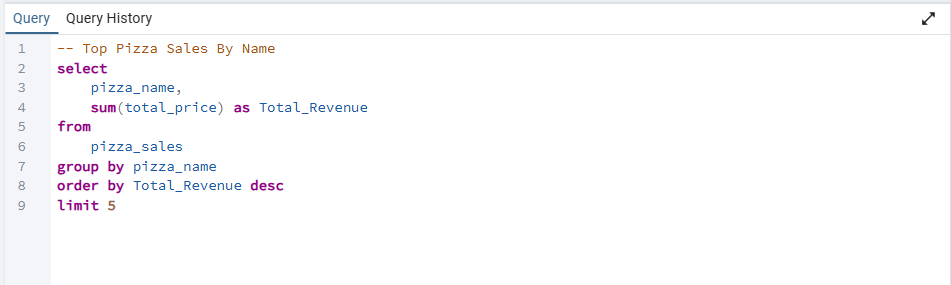
*Determined the top 5 revenue-generating pizzas to pinpoint key drivers of overall sales performance.*

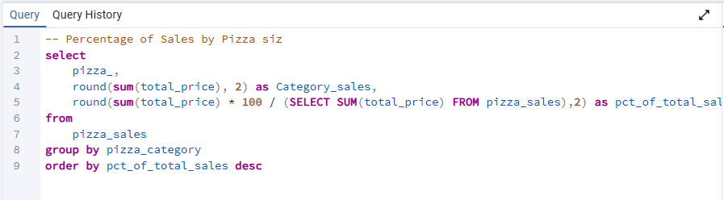
*Calculated the percentage contribution of each pizza category (Classic, Supreme, Veggy, Chicken) to total revenue.*

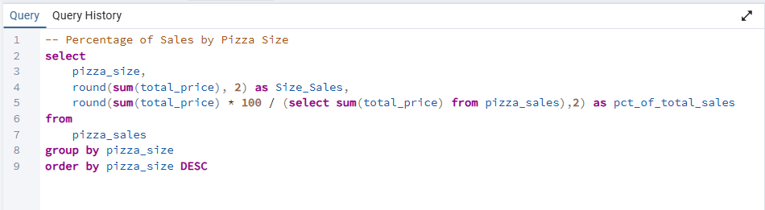
*Analyzed revenue percentage by pizza size (Large, Medium, Small) to understand consumer sizing preferences.*

---

### 📊 Excel Data Processing & Dashboard

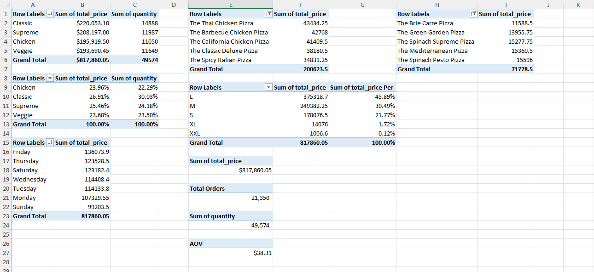
*Utilized dynamic Excel Pivot Tables to aggregate raw sales data, summarize key metrics, and prepare the foundation for dashboard visual components.*

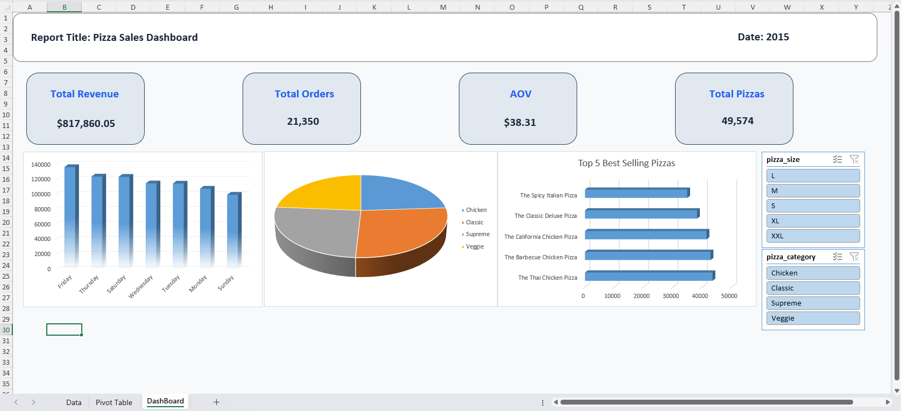
*Built an interactive Excel dashboard incorporating Pivot Charts and Slicers to allow quick filtering and quick dynamic high-level reporting.*

---

### 🖥️ Power BI Interactive Dashboard

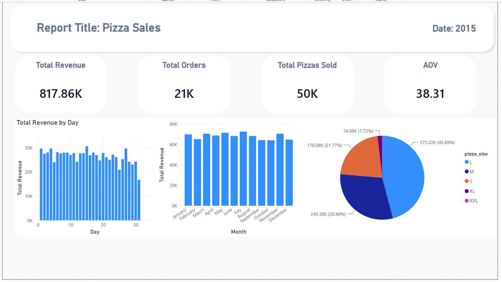
*Developed an end-to-end interactive Power BI dashboard featuring advanced DAX calculations, structured data modeling, and custom visuals for deep-dive exploratory data analysis.*

---

## 📊 Executive Insights & Key Findings

### 1. Overall Key Performance Indicators (KPIs)

- **Total Revenue:** $817.86K generated across the 2015 fiscal period.
- **Total Orders:** 21,350 distinct transactions processed.
- **Total Pizzas Sold:** 49,574 individual units sold.
- **Average Order Value (AOV):** $38.31 spent per transaction on average.

### 2. Operational Trends & Peak Demand

- **Peak Sales Days:** **Friday** and **Thursday** record the highest order volumes and sales activity, indicating key operational windows that require optimized kitchen staffing and inventory readiness.

### 3. Product Preferences & Category Breakdown

- **Top Category:** The **Classic** pizza category leads the market share in terms of total customer demand and revenue contribution.
- **Preferred Size:** **Large (L)** size pizzas are overwhelmingly preferred by customers, representing the dominant portion of total sales volume.

### 4. Product Performance (Top & Bottom)

- **Top Revenue Generator:** **The Thai Chicken Pizza** stands out as the highest-grossing product by revenue.
- **Lowest Revenue Generator:** **The Brie Carre Pizza** recorded the lowest revenue performance, suggesting an opportunity for menu optimization, special promotions, or replacement.

---

## 📁 Repository Structure

```text
Pizza_Sales/
│
├── Data/
│   └── pizza_sales.csv               # Raw dataset extracted from Kaggle
│
├── SQL/
│   └── pizza_sales_queries.sql       # SQL scripts for table creation and analysis
│
├── Excel/
│   └── pizza_sales_analysis.xlsx     # Excel workbook with Pivot Tables & Dashboard
│
├── Power_BI/
│   └── pizza_sales_report.pbix       # Power BI report file with interactive visuals
│
├── Images/                           # Screenshots used in the documentation
│   ├── Create_Table.png
│   ├── KPIs.png
│   └── ...
│
├── README.md                         # Main documentation (English)
└── README.ar.md                      # Arabic documentation (Optional)
```

🚀 How to Run & Replicate
Database Setup:

Open your preferred SQL database management tool (e.g., PostgreSQL / SQL Server).

Run the schema creation script located in SQL/pizza_sales_queries.sql.

Import Data/pizza_sales.csv into the created table to execute analytical queries.

Excel Dashboard:

Open Excel/pizza_sales_analysis.xlsx using Microsoft Excel (2016 or newer) to interact with Pivot Tables and Slicers.

Power BI Dashboard:

Open Power_BI/pizza_sales_report.pbix using Power BI Desktop to explore interactive filters and data modeling.

🤝 Connect with Me

LinkedIn: [Esam Haraz](www.linkedin.com/in/esam-haraz-459925402)

GitHub: BananaLeauge

Email: <esamv20@gmail.com>
